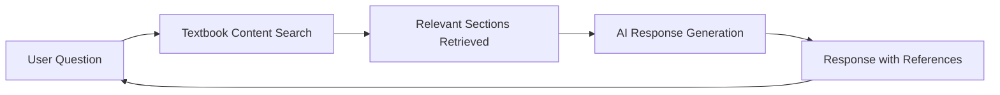

# Enhancing Robotics Education with AI Tutor Integration

In our Physical AI & Humanoid Robotics textbook, we've integrated a sophisticated AI tutor that leverages Retrieval-Augmented Generation (RAG) to provide personalized learning experiences. This blog post explains how this system works and how you can make the most of it.

## How Our AI Tutor Works

### Retrieval-Augmented Generation (RAG)

Our AI tutor combines a large language model with a retrieval system that accesses the entire textbook content. When you ask a question:

1. The system searches the textbook for relevant content
2. It provides context from the relevant sections to the AI model
3. The AI generates a response that's grounded in the textbook material
4. It provides references to specific sections for further reading

### Personalized Learning

The system adapts to your learning preferences and tracks your progress through the material:

- **Learning Style Recognition**: The tutor identifies whether you prefer visual, theoretical, or hands-on learning
- **Progress Tracking**: It remembers which topics you've mastered and which need more work
- **Adaptive Difficulty**: The explanations are adjusted based on your understanding level
- **Recommendation Engine**: It suggests related topics that would enhance your understanding

## Using the AI Tutor Effectively

### Asking Good Questions

To get the most out of the AI tutor:

- Be specific: "How does ROS2 handle message synchronization?" is better than "Explain ROS2"
- Reference specific examples: "In the walking controller example, why do we use ZMP?"
- Ask for clarification: "I don't understand the math in section 3.2"
- Request practical examples: "Can you show me a code example for this concept?"

### Understanding AI Responses

Remember that:

- The AI tutor draws from the textbook content, so responses are grounded in our curriculum
- When uncertain, the AI will acknowledge limitations rather than making things up
- References to specific textbook sections are provided when relevant
- Complex questions might require multiple interactions to fully explore

## Technical Implementation

### Backend Architecture

The AI tutor runs on our backend API, which includes:

- A Qdrant vector database for fast content retrieval
- OpenAI-compatible endpoints for response generation
- Context7 integration for enhanced MCP and API tools
- PostgreSQL database for user profiles and learning progress

### RAG Pipeline

## Getting Started

You can access the AI tutor through the API endpoints documented at [http://localhost:8000/docs](http://localhost:8000/docs) when the backend is running. The tutor is designed to complement your reading of the textbook, providing immediate answers and deeper explanations as you progress through the material.

## Future Development

We're continuously improving our AI tutor with:

- More sophisticated personalization algorithms
- Integration with simulation environments
- Support for interactive coding exercises
- Multi-language capabilities (Urdu translation is in development)

We hope this AI tutor enhances your learning experience and helps you master the complex concepts of Physical AI and Humanoid Robotics!